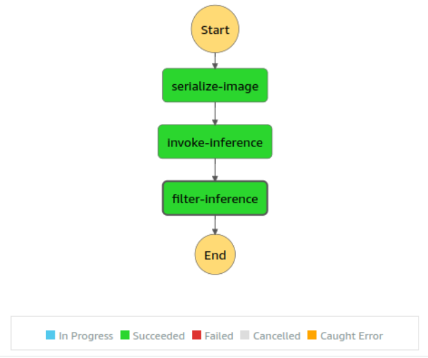
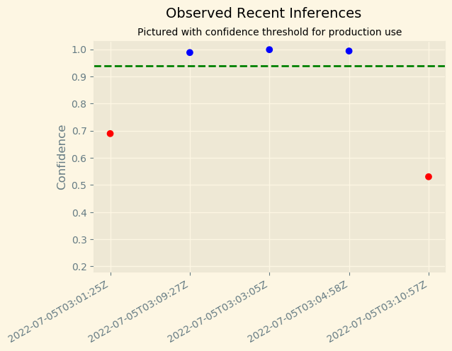
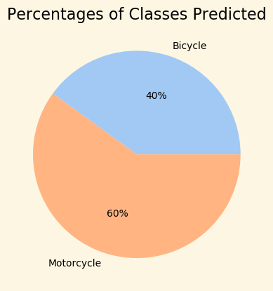

# Udacity AWS ML P2 - Workflow

Project 2 in the Udacity AWS Machine Learning Nanodegree -- Image Classification Workflow for the fictional "Scones Unlimited" business.

Image classification to distinguish between bicycles and motorcycles to optimize deliveries.

The CIFAR-100 dataset is used for training and testing.

---
## Extract, Transform, Load (ETL)
CIFAR-100 data is downloaded from the University of Toronto, a tar.gz file.  Image data and fine labels were extracted, for only those images labeled bicycle or motorcycle, and saved to local disk, and then loaded to S3.  Image data was transformed into 3 (RGB) X 32 X 32 (W X H) PNG images.  

---
## Model Training
A SageMaker Estimator was constructed using the SageMaker image classification algorithm.  Hyperparameters were selected:
- image shape
- number of classes (2 - bicycle and motorcycle)
- number of training sampels (number of images in train dataset)

The model was trained using the train and test (for validation) datasets.

---
## Construct API Endpoint
A data capture model monitor was configured to capture all (100 %) events passing through the model.  Captured data was stored in S3.

With the model monitor in place, the model was deployed to an endpoint.  The name of the endpoint was noted as it is needed for invoking the endpoint from the second Lambda function, invokeInference -- see below.

---
## Build Machine Learning Workflow

### Lambda Functions
Three Lambda functions were authored:
- serializeImageData
- invokeInference
- filterInferences

The code from all three Lambda functions have been included in the Lambda.py file.

Lambda Functions were tested individually using test configurations.

The serializeImageData Lambda function downloads image data from an S3 bucket location and encodes it in base64.  Image data is returned in the body of the response.

The invokeInference Lambda function invokes the endpoint, passing in the image data obtained from the first Lambda function.  The inference result, a list of two confidence scores, one for the bicycle class, and one for the motorcycle class, is returned in the body of the response. A runtime sagemaker object was used to invoke the endpoint -- as opposed to uploading a zip file package containing the SageMaker dependencies.  

[Reference: Call SageMaker model endpoint using API Gateway and AWS Lambda](https://aws.amazon.com/blogs/machine-learning/call-an-amazon-sagemaker-model-endpoint-using-amazon-api-gateway-and-aws-lambda/)

Creating and uploading a package zip file containing the Lambda function and the SageMaker dependencies was problematic.  Pip complained of unresolved dependencies. The workaround was to modify the install command to include all the dependencies (and the correct versions; e.g., numpy==1.22).  The resulting zip file was 46 MB when made on a Windows machine.  It was 60 MB made on a Linux machine.  Lambda complained about the size.  For the Linux-made package, it had to be uploaded to S3 first.  And because of the size it was not possible to see and edit the lambda_function.py code directly in Lambda.  That made debugging very painful, since any minor changes required rezipping the package and re-uploading to Lambda.  And while the Linux-made zip package worked, Lambda complained that it couldn't find the lambda-function in the Windows zip package.  Other students have encountered the same issues, so it seems like this project could use some improvement.

The filterInferences Lambda function takes the inferece data from the previous Lambda function and fails any inference that does not have at least a 90 % confidence in either the bicycle classification or the motorcycle classification.

### Step Function (State Machine)
A step function was created using the AWS visual editor.  The above three Lambda functions were added, in order. Outputs from the previous Lambda function were inputs into the next Lambda function.

Several executions of the step function were performed to demonstrate both positive (confidence score > threshold) and negative (confidence score < threshodl) results.  In the case of a negative result, an exception is thrown.

---
## Testing and Evaluation
Several executions of the Step Function were performed -- sending random input images from the test dataset through the state machine.

Data saved to S3 by the Model Monitor were downloaded to a local directory in SageMaker Studio.

---
## Visualizations from Model Monitor
Inference and timestamp data was extracted from the JSONL files downloaded from S3.  Confidence levels for the recently obtained inferences were plotted.

As an additional visualization, a pie chart showing the percentages of predictions for bicycles and motorcycles was plotted using the Seaborn 'pastel' colors.

---
## Cleanup
Monitors and the deployed endpoint were deleted.